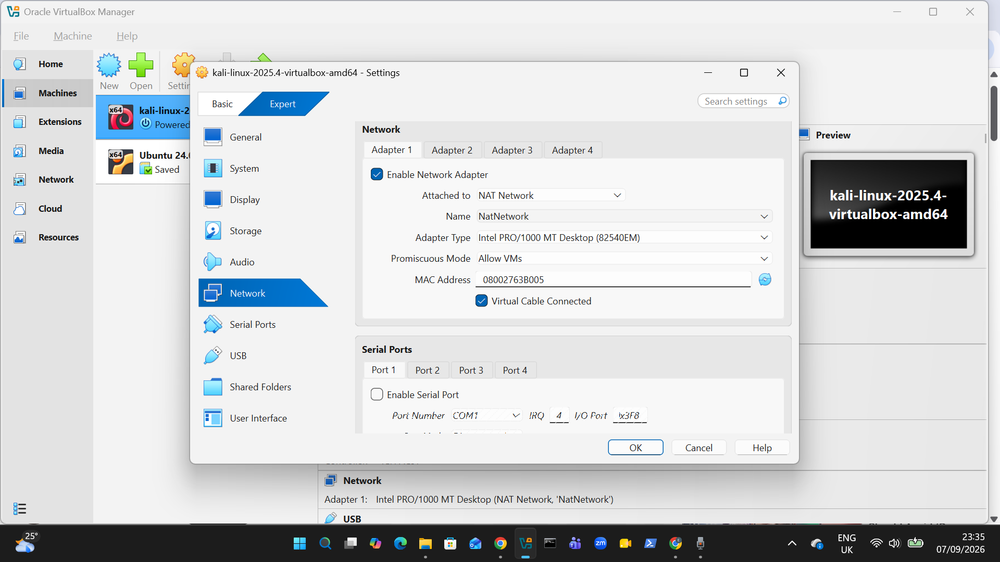
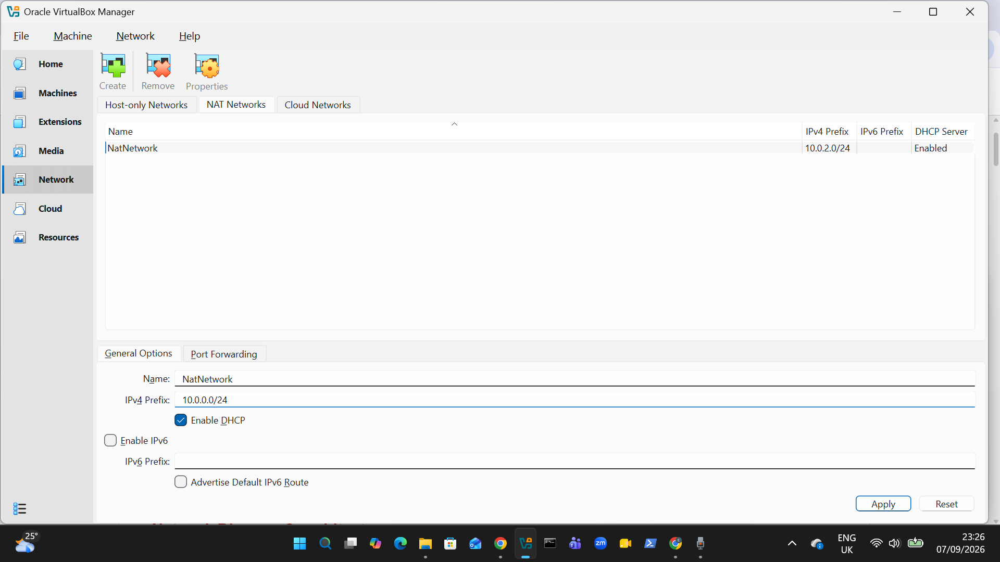
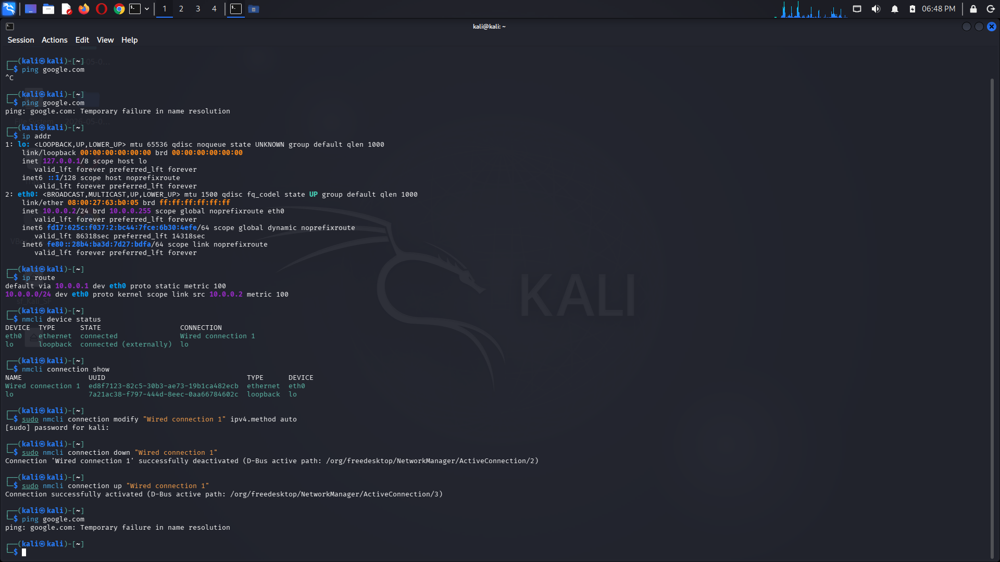
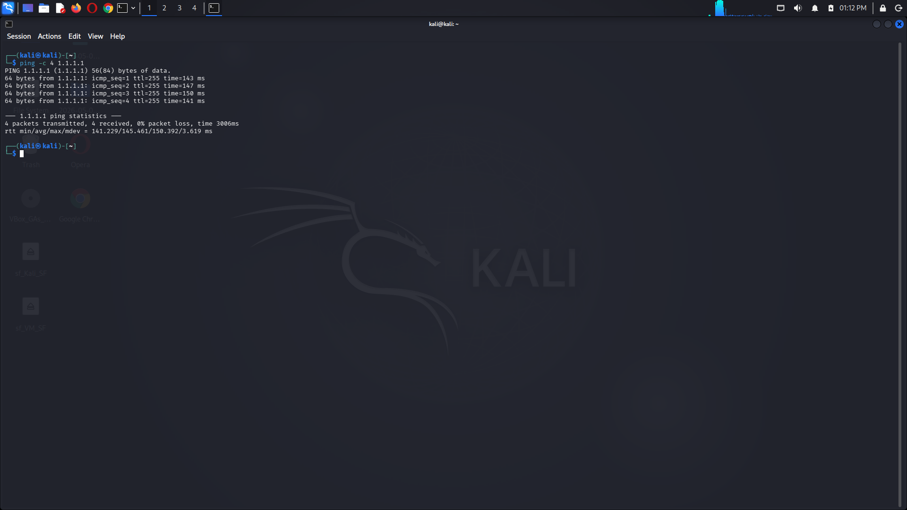
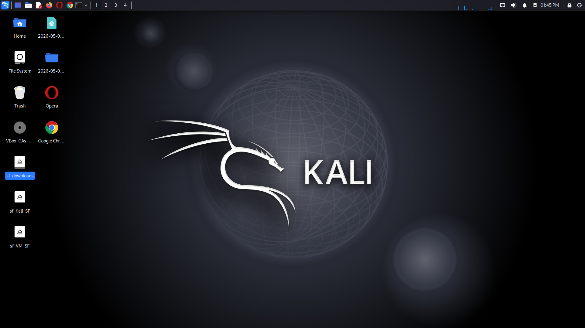
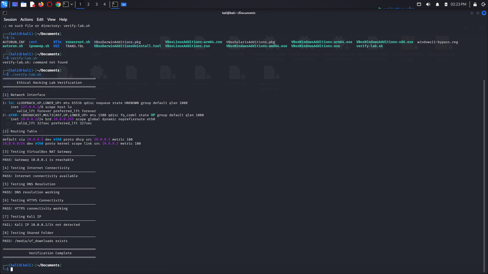

# 🔐 NetworkWalks — Week 1 Cybersecurity Project

## Ethical Hacking Lab Setup with Kali Linux & VirtualBox

**Building an isolated virtual lab for penetration testing and ethical hacking practice**
</div>

<p align="center">
  
  
  
  
  
  
  
  
  
  
  
  
</p>

This project was completed as part of my **Cybersecurity / Ethical Hacking training with NetworkWalks**.

The objective of Week 1 was to build a functional and controlled cybersecurity laboratory using **Kali Linux and Oracle VirtualBox**. The environment provides a safe foundation for practicing ethical hacking and security testing in subsequent projects.

---

## 🎯 Project Objectives

The main objectives of this project were to:

* Set up Kali Linux in VirtualBox.
* Create a dedicated VirtualBox NAT Network.
* Configure the laboratory network using `10.0.0.0/24`.
* Configure Kali Linux with a static IP address.
* Establish Internet connectivity.
* Verify network configuration and routing.
* Configure a shared folder between the host and Kali Linux.
* Enable VirtualBox integration features.
* Create and verify a repeatable cybersecurity lab environment.

---

# 🏗️ Lab Architecture

```text
                 Ubuntu Host Machine
                         │
                         │
                  Oracle VirtualBox
                         │
                         ▼
              ┌─────────────────────┐
              │     EH-Lab-NAT      │
              │    10.0.0.0/24      │
              │                     │
              │ Gateway: 10.0.0.1   │
              └──────────┬──────────┘
                         │
                         ▼
                ┌─────────────────┐
                │    Kali Linux   │
                │                 │
                │ 10.0.0.2/24     │
                │                 │
                │ Attacker /      │
                │ Security Lab    │
                └─────────────────┘
                         │
                         ▼
                   Internet Access
```

The Kali Linux machine serves as the security-testing workstation.

The network was configured as a dedicated laboratory environment so that future security exercises can be performed against intentionally vulnerable targets in a controlled setting.

---

# 🌐 Network Configuration

| Component       | Configuration          |
| --------------- | ---------------------- |
| Network Name    | `NatNetwork`           |
| Network Type    | VirtualBox NAT Network |
| Network Address | `10.0.0.0/24`          |
| Gateway         | `10.0.0.1`             |
| Kali Linux IP   | `10.0.0.2/24`          |
| Subnet Mask     | `255.255.255.0`        |
| DHCP            | Disabled               |
| DNS             | `1.1.1.1`, `8.8.8.8`   |

### Addressing Plan

```text
10.0.0.1   → VirtualBox Gateway
10.0.0.2   → Kali Linux
10.0.0.10+ → Future Lab Targets
```

The additional addresses are reserved for future machines that may be introduced into the lab.

---

# 🖥️ VirtualBox Configuration

Kali Linux was configured as a virtual machine using Oracle VirtualBox.

The VM configuration included:

* Kali Linux
* Virtual network adapter
* `NatNetwork` NAT Network
* Shared Clipboard
* Drag and Drop
* Shared Folder
* Guest integration

The VirtualBox configuration was verified before proceeding with the network tests.

### Evidence



---

# 🌐 NAT Network

A dedicated NAT Network named:

```text
EH-Lab-NAT
```

was created with the following configuration:

```text
Network: 10.0.0.0/24
Gateway: 10.0.0.1
DHCP: Disabled
```

This provides a dedicated network for the cybersecurity laboratory.

### Evidence



---

# 🐉 Kali Linux

Kali Linux was used as the attacker/security-testing machine.

Kali provides a large collection of tools commonly used for:

* Reconnaissance
* Network scanning
* Enumeration
* Vulnerability assessment
* Password security testing
* Web application security testing
* Traffic analysis
* Security research

The Kali machine was configured with the static address:

```text
10.0.0.2/24
```

### Evidence



---

# 🔌 Network Connectivity

After configuring the static IP address, connectivity was tested to ensure that the Kali machine could communicate with the VirtualBox gateway and access external resources.

The laboratory network was tested at multiple levels:

```text
Kali Linux
    │
    ├── Local Network
    │      └── 10.0.0.1
    │
    └── Internet
           └── External connectivity
```

### Internet Test

Internet connectivity was verified from Kali Linux.



---

# 📁 Shared Folder

A VirtualBox shared folder /downloads was configured between the Ubuntu host machine and Kali Linux.

The shared folder provides a convenient way to transfer legitimate project files, scripts, screenshots, and documentation between the host and the cybersecurity laboratory.

The guest environment was configured to access the shared folder.

### Evidence



---

# 🧪 Lab Verification

A verification process was used to confirm that the main components of the laboratory were functioning correctly.

The checks included:

* Kali IP configuration
* Network connectivity
* Gateway connectivity
* Internet access
* DNS resolution
* Shared folder availability
* VirtualBox integration

The final verification confirmed that the laboratory environment was ready for the next stage of the cybersecurity exercises.

### Verification Evidence



---

# 📸 Project Evidence

The repository contains screenshots documenting the completed setup:

```text
networkwalks-week1-cybersecurity-project/
│
├── internet-test.png
├── kali-ip.png
├── nat-network.png
├── README.md
├── shared-folder.png
├── verify-lab.png
└── virtualbox-settings.png
```

| Screenshot                | Purpose                            |
| ------------------------- | ---------------------------------- |
| `virtualbox-settings.png` | Virtual machine configuration      |
| `nat-network.png`         | NAT Network configuration          |
| `kali-ip.png`             | Kali Linux IP configuration        |
| `internet-test.png`       | Internet connectivity verification |
| `shared-folder.png`       | Shared folder configuration        |
| `verify-lab.png`          | Final laboratory verification      |

---

# 🧠 Key Learning Outcomes

This project provided practical experience with several foundational cybersecurity concepts.

### Virtualization

Learned how to create and configure a dedicated cybersecurity environment using VirtualBox.

### Networking

Worked with:

* IPv4 addressing
* CIDR notation
* Subnets
* Gateways
* DNS
* NAT
* Static IP configuration

### Kali Linux

Established Kali Linux as the primary security-testing environment for future ethical hacking exercises.

### Network Isolation

Learned the importance of creating a controlled environment before conducting security testing.

### Troubleshooting

Worked through issues involving:

* Network configuration
* Internet connectivity
* DNS resolution
* VirtualBox shared-folder permissions
* Guest integration

### Documentation

Documented the environment and captured evidence of the completed configuration.

---

# 🔐 Security Scope

This laboratory is intended strictly for **authorized cybersecurity education and ethical hacking practice**.

Future testing will be performed only against:

* Systems owned by me
* Intentionally vulnerable laboratory machines
* Purpose-built security training environments
* Systems where explicit authorization has been provided

No unauthorized systems or networks will be targeted.

---

# 🚀 Next Steps

This Week 1 project establishes the foundation for future NetworkWalks cybersecurity projects.

Planned areas of study include:

```text
Lab Setup
    │
    ▼
Reconnaissance
    │
    ▼
Enumeration
    │
    ▼
Vulnerability Assessment
    │
    ▼
Password Security
    │
    ▼
Web Application Security
    │
    ▼
Controlled Exploitation
    │
    ▼
Detection & Remediation
```

The next phase will introduce intentionally vulnerable targets into the laboratory and begin practical reconnaissance and enumeration exercises.

---

# 🏁 Conclusion

Week 1 focused on building the foundation rather than immediately attacking a target.

The completed laboratory provides a controlled environment where cybersecurity concepts can be explored practically while maintaining clear boundaries around authorization and safety.

This project marks the beginning of my hands-on **Ethical Hacking and Cybersecurity journey with NetworkWalks**.

> **Learn. Build. Test. Secure.**

---

## 👤 Author

**Elvis Halim**

Cybersecurity & Ethical Hacking Trainee
DevOps | DevSecOps | Cloud Infrastructure

---

## ⚠️ Disclaimer

This repository is intended for educational purposes and authorized security testing only.

Cybersecurity tools and techniques should only be used against systems that you own or have explicit permission to test.
